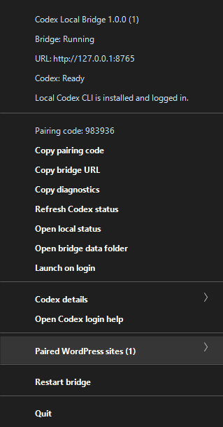

# AI Model Relay

Formerly **Codex Local Bridge**. All `/v1` API routes, `codex-local:auto`/`codex-local:image` model IDs, the default bridge URL, and the state-folder path are unchanged. Local ASR model IDs have moved from `codex-local:audio:*` to `local-asr:*`, with the old audio prefix accepted as a compatibility alias. See [Naming and Compatibility](docs/operations.md#naming-and-compatibility) in the operations guide for the full change list.

Windows tray companion for Alorbach AI Subscription Gateway. It exposes a secure localhost relay that routes browser-mediated jobs to backend drivers such as Codex CLI, local ASR, Grok/xAI API, configurable CLI tools, API-key chat providers, and optional OpenAI video generation while WordPress still owns plans, quotas, audit records, and optional Gateway fees.

## Status

- Platform: Windows desktop tray app.
- Runtime: Electron plus a local Node HTTP bridge.
- Bridge URL: `http://127.0.0.1:8765` by default.
- License: `GPL-2.0-or-later`.
- Release model: pushed `v*` tags build a Windows installer and portable ZIP.

## What It Does

- Runs as a tray app in the logged-in Windows user's session.
- Starts a local HTTP bridge bound to `127.0.0.1`.
- Pairs trusted browser origins using a six digit tray-displayed pairing code.
- Stores a per-origin bearer token in the user's bridge state directory.
- Executes signed Gateway chat jobs through local `codex exec`.
- Executes signed Gateway image jobs and returns normalized base64 image data.
- Executes signed Gateway audio transcription jobs through private local ASR runtimes with per-word timestamps, or through explicitly selected xAI Speech-to-Text.
- Optionally runs a separate local music-analysis pipeline for acoustic album metrics; it does not infer lyrics or send audio to a cloud provider.
- Routes provider-neutral relay jobs through backend drivers for Codex CLI, local ASR, Grok/xAI, configurable CLI processes, API-key chat providers, and OpenAI video.
- Reports local bridge multimodal capabilities, including structured Codex event support and optional video/media features.
- Optionally executes signed OpenAI Videos API jobs when explicitly configured with an API key and enable flag.
- Optionally analyzes bounded media frames or HTTPS media URLs through local Codex vision prompts.
- Runs local Codex jobs with bounded parallelism and queues overflow requests.
- Shows bridge status, Codex login status, paired sites, diagnostics, restart, and unpair actions in the tray menu.
- Opens a minimal local status page on tray icon double-click.

## Tray Menu



## Status Page

Double-click the tray icon or use `Open status page` to open the local status page:


## Requirements

- Windows 10 or later.
- Codex CLI installed and logged in for the same Windows account that runs the tray app.
- Node.js 20+ for development builds.
- Alorbach AI Subscription Gateway with User-owned Local Codex enabled for production WordPress usage.
- Optional Local ASR transcription/alignment: Python 3.10 for faster-whisper, Python 3.12 for Qwen3 ASR and Qwen3 ForcedAligner, ffmpeg/ffprobe on PATH, and cached Hugging Face models or explicit permission to download models.
- Optional local music analysis: Python 3.10+, ffmpeg/ffprobe on PATH, and a dedicated virtual environment with `numpy`, `scipy`, `soundfile`, `librosa`, and `pyloudnorm`. The status page's explicit setup action creates and installs this environment; it is never downloaded automatically.

Before pairing, log in to Codex in the same Windows account:

```powershell
codex login
```

## Install From Release

1. Open the latest release at <https://github.com/alorbach/ai-model-relay/releases>.
2. Download either the Windows installer `.exe` or portable `.zip`.
3. Start `Codex Local Bridge`.
4. Open the tray menu and confirm `Codex: Ready`.
5. In WordPress, enable `AI Gateway -> Settings -> Providers / Import -> User-owned local Codex`.
6. Keep the bridge URL as `http://127.0.0.1:8765` unless a custom port is required.
7. Choose a Local Codex model such as `codex-local:auto` or `codex-local:image`.
8. Enter the pairing code shown in the tray app when WordPress prompts for it.

For local audio transcription, open the bridge status page after installation and review `Local ASR Settings`. By default, the bridge can create private Python virtual environments under `%USERPROFILE%\.alorbach-codex-bridge\asr-venv` for faster-whisper and `%USERPROFILE%\.alorbach-codex-bridge\qwen-asr-venv` for Qwen3 ASR/ForcedAligner. Package installation is controlled by the ASR setting, and model downloads stay disabled until explicitly enabled or local model paths are configured.

For local album metrics, use the separate `Local Music Analysis Settings` panel. Its setup button creates `%USERPROFILE%\.alorbach-codex-bridge\music-analysis-venv` and installs the local analysis packages only after you ask it to. It returns tempo/beat grid, key estimate, loudness, spectral descriptors, and neutral numbered sections; it does not perform stem separation, chord recognition, melody/MIDI extraction, or automatic transcription.

## Documentation

- [Architecture](docs/architecture.md)
- [Local Bridge API](docs/local-bridge-api.md)
- [Gateway Integration](docs/gateway-integration.md)
- [Operations](docs/operations.md)
- [Standalone HTTP example](examples/http-app/README.md)

The Gateway-side reference implementation is in the [Alorbach AI Subscription Gateway](https://github.com/alorbach/alorbach-ai-subscription-gateway/) WordPress plugin:

```text
https://github.com/alorbach/alorbach-ai-subscription-gateway/blob/main/wordpress-plugin/includes/class-local-codex-bridge.php
https://github.com/alorbach/alorbach-ai-subscription-gateway/blob/main/wordpress-plugin/assets/js/demo-pages.js
```

## Local Development

Install dependencies:

```powershell
npm ci
```

Run the tray app:

```powershell
npm start
```

Run the local bridge without Electron:

```powershell
npm run serve
```

Run the standalone developer HTTP example:

```powershell
npm run example:http
```

Then open:

```text
http://127.0.0.1:8787
```

Run checks:

```powershell
npm test
npm run smoke
```

## Bridge API Summary

Default base URL:

```text
http://127.0.0.1:8765
```

Routes:

- `GET /status`: minimal visual bridge status page.
- `GET /v1/status`: local bridge and Codex readiness.
- `GET /v1/relay/status`: provider-neutral alias for status.
- `GET /v1/status/events`: local job-state event stream used by the status page.
- `GET /v1/status/stream`: paired live status stream for browser/API clients.
- `GET /v1/capabilities`: bridge, Codex, video, and media-analysis capability metadata.
- `GET /v1/relay/capabilities`: provider-neutral capabilities, including backend driver metadata.
- `GET /v1/asr/settings`: Local ASR settings and cached runtime metadata. Add `?refresh=1` to run a full Python/GPU/ffmpeg probe.
- `GET /v1/music-analysis/settings`: local music-analysis settings and cached runtime metadata. Add `?refresh=1` to run its Python/ffmpeg probe.
- `POST /v1/music-analysis/settings`, `/v1/music-analysis/setup`: save local music settings or deliberately create/install its private Python environment.
- `POST /v1/pair`: exchange tray pairing code for an origin token.
- `POST /v1/unpair`: remove the pairing for the request origin.
- `GET /v1/models`: list paired local model IDs.
- `GET /v1/relay/models`: list provider-neutral `model-relay:*` model IDs in addition to legacy IDs.
- `POST /v1/chat`: run a signed chat job.
- `POST /v1/images`: run a signed image job.
- `POST /v1/transcribe`: run a signed local ASR transcription job.
- `POST /v1/videos`: optionally run a signed OpenAI Videos API job.
- `POST /v1/media/analyze`: analyze bounded media frames or an HTTPS media URL.
- `POST /v1/music/analyze`: analyze a local audio payload with the separate local music-analysis pipeline.
- `POST /v1/relay/jobs/chat`, `/images`, `/transcribe`, `/videos`, `/media/analyze`, and `/music/analyze`: provider-neutral job aliases using the same signed envelope and response shapes.

Paired routes require:

```http
Origin: <paired-browser-origin>
X-Alorbach-Bridge-Token: <pairing-token>
X-Alorbach-Request-Id: <request-id>
```

Execution routes require a JSON envelope containing:

```json
{
  "job_token": "...",
  "request_hash": "...",
  "request_id": "...",
  "payload": {}
}
```

In production, these values come from WordPress Gateway. The relay checks that they are present, executes the selected backend driver, and returns the result to the browser. WordPress validates the one-time token and request hash when the browser completes the job.

Legacy requests can keep using `codex-local:auto` and `codex-local:image`. New provider-neutral requests may use IDs such as `model-relay:codex:auto`, `model-relay:xai:grok-4.3`, `model-relay:xai:stt`, `model-relay:local-asr:qwen3-asr-0.6b`, and `model-relay:music-analysis:core`, or set `payload.provider` / `payload.backend`. Local ASR models now use `local-asr:*` IDs (e.g. `local-asr:whisper-large-v3`, `local-asr:qwen3-asr-0.6b`). `model-relay:xai:stt` deliberately uploads the supplied audio to xAI; Local ASR and music analysis stay local.

`GET /v1/status` also includes current local job activity:

```json
{
  "jobs": {
    "running_count": 1,
    "queued_count": 0,
    "max_concurrent": 2,
    "active": [
      {
        "request_id": "request-123",
        "short_request_id": "request-123",
        "type": "chat",
        "model": "codex-local:auto",
        "status": "running",
        "elapsed_ms": 1200
      }
    ]
  }
}
```

The `/status` page auto-refreshes and shows active, queued, and recent job activity with bounded live Codex session output for running jobs. Failed bridge requests include a `debug_help` object with the request id when available, links to `/status` and `/v1/status`, and safe troubleshooting checks. Recent failed jobs keep bounded Codex session output such as stderr/stdout/last response text when available.

Each local model invocation also writes full temporary debug files under `%TEMP%\alorbach-codex-local-bridge-debug`. The bridge deletes that directory on startup. Each invocation folder contains `prompt.txt`, `output.txt`, `stdout.txt`, `stderr.txt`, and `metadata.json`; these files are intentionally full-fidelity and can include prompt text, transcripts, lyrics, and local temp paths.

Paired browser/API clients can subscribe to `GET /v1/status/stream` with their normal `Origin` and `X-Alorbach-Bridge-Token` headers. Browsers set `Origin` automatically; non-browser clients must send the paired origin explicitly. The stream emits `status`, `capabilities`, `jobs`, and `heartbeat` server-sent events. Use `fetch()` streaming for browser clients because native `EventSource` cannot send the required bearer header:

```js
const response = await fetch('http://127.0.0.1:8765/v1/status/stream', {
	headers: {
		'X-Alorbach-Bridge-Token': bridgeToken,
	},
});

for await (const chunk of response.body.pipeThrough(new TextDecoderStream())) {
	console.log(chunk);
}
```

## Security Model

- The bridge binds only to `127.0.0.1`.
- Non-localhost socket clients are rejected.
- Browser origins must be paired before model and execution routes are accepted.
- Pairing tokens are per origin and stored in `%USERPROFILE%\.alorbach-codex-bridge\state.json`.
- The tray diagnostics omit bearer token values.
- Temporary local-model debug logs are full-fidelity and are deleted on bridge startup.
- Requests have a 12 MiB JSON body limit.
- Codex runs in ephemeral temp directories for bridge jobs.
- Production accounting and duplicate protection stay in WordPress Gateway, not in the local tray app.

## Runtime Configuration

- `ALORBACH_CODEX_BRIDGE_PORT`: relay port. Default: `8765`.
- `AI_MODEL_RELAY_STATE_DIR` or `ALORBACH_MODEL_RELAY_STATE_DIR`: explicit relay state directory. If unset, the app uses `%USERPROFILE%\.ai-model-relay` only when it already exists; otherwise it keeps the legacy `%USERPROFILE%\.alorbach-codex-bridge` directory for compatibility.
- `ALORBACH_CODEX_BINARY`: explicit path to `codex.exe` or another Codex executable.
- `CODEX_HOME`: Codex profile directory. Default: `%USERPROFILE%\.codex`.
- `ALORBACH_CODEX_MAX_CONCURRENT_JOBS`: maximum parallel local Codex jobs. Default: `2`.
- `ALORBACH_CODEX_CHAT_TIMEOUT_MS`: chat timeout. Default: `600000`.
- `ALORBACH_CODEX_IMAGE_TIMEOUT_MS`: image timeout. Default: `1800000`.
- `ALORBACH_ASR_PYTHON`: explicit Python executable for Local Whisper setup.
- `ALORBACH_ASR_VENV`: Local Whisper virtual environment path. Default: `%USERPROFILE%\.alorbach-codex-bridge\asr-venv`.
- `ALORBACH_QWEN_ASR_PYTHON`: explicit Python executable for Local Qwen ASR setup.
- `ALORBACH_QWEN_ASR_VENV`: Local Qwen ASR virtual environment path. Default: `%USERPROFILE%\.alorbach-codex-bridge\qwen-asr-venv`.
- `ALORBACH_QWEN_TORCH_INDEX_URL`: PyTorch CUDA wheel index used when repairing the Qwen ASR venv. Default: `https://download.pytorch.org/whl/cu128`.
- `ALORBACH_QWEN_ALLOW_CPU_OFFLOAD`: set to `0` to disable mixed GPU/CPU Qwen loading for models that do not fit fully in VRAM.
- `ALORBACH_QWEN_CHUNK_SECONDS`: local pre-chunk size for Qwen ASR timestamped transcription. Default: `30`.
- `ALORBACH_QWEN_MAX_WORD_DURATION_SECONDS`: cap for implausibly stretched Qwen word timestamps. Default: `12`.
- `ALORBACH_ASR_DEFAULT_MODEL`: optional default Local ASR model slug when a transcription request does not provide `payload.model`, for example `qwen3-asr-0.6b`.
- `ALORBACH_ASR_CPU_THREADS`: CPU threads for faster-whisper. Default: `4`.
- `ALORBACH_ASR_TRANSCRIBE_TIMEOUT_MS`: transcription timeout. Default: `1800000`.
- `ALORBACH_ASR_PROBE_TTL_MS`: cached Local ASR runtime probe lifetime. Default: `30000`.
- `ALORBACH_ASR_CUDA_PATHS`: additional CUDA DLL search paths, separated with the Windows path delimiter.
- `ALORBACH_MUSIC_ANALYSIS_PYTHON`: explicit base Python executable for local music-analysis setup.
- `ALORBACH_MUSIC_ANALYSIS_VENV`: local music-analysis virtual environment. Default: `%USERPROFILE%\.alorbach-codex-bridge\music-analysis-venv`.
- `ALORBACH_MUSIC_ANALYSIS_SAMPLE_RATE`: decode sample rate for local music analysis. Default: `22050`.
- `ALORBACH_MUSIC_ANALYSIS_MAX_SECTIONS`: maximum neutral section boundaries. Default: `12`; range: `2`-`24`.
- `ALORBACH_MUSIC_ANALYSIS_TIMEOUT_MS`: local music-analysis timeout. Default: `1800000`.
- `ALORBACH_MUSIC_ANALYSIS_PROBE_TTL_MS`: cached local music runtime probe lifetime. Default: `30000`.
- `ALORBACH_CODEX_ENABLE_VIDEO`: set to `1` to enable the optional OpenAI Videos API route.
- `ALORBACH_OPENAI_API_KEY` or `OPENAI_API_KEY`: API key for optional video generation.
- `ALORBACH_VIDEO_POLL_TIMEOUT_MS`: optional video polling timeout. Default: `600000`.
- `ALORBACH_VIDEO_POLL_INTERVAL_MS`: optional video polling interval. Default: `3000`.
- `XAI_API_KEY` or `AI_MODEL_RELAY_XAI_API_KEY`: enables the Grok/xAI API chat backend and the explicit cloud transcription model `model-relay:xai:stt`.
- `XAI_BASE_URL` or `AI_MODEL_RELAY_XAI_BASE_URL`: optional xAI-compatible base URL. Default: `https://api.x.ai/v1`.
- `AI_MODEL_RELAY_XAI_MODELS`: comma-separated Grok model IDs exposed as `model-relay:xai:*`. Default: `grok-4.3,latest`.
- `AI_MODEL_RELAY_CLI_COMMAND`: enables the generic CLI process chat backend.
- `AI_MODEL_RELAY_CLI_ARGS`: optional arguments for the CLI process backend. The prompt is sent on stdin.
- `AI_MODEL_RELAY_CLI_TIMEOUT_MS`: CLI process timeout. Default: `600000`.
- `AI_MODEL_RELAY_CHAT_API_KEY`, `AI_MODEL_RELAY_CHAT_BASE_URL`, and `AI_MODEL_RELAY_CHAT_MODEL`: optional OpenAI-compatible API-key chat backend profile for Cursor-style or other provider keys.

If Windows resolves `codex` to a problematic `.cmd` shim, set `ALORBACH_CODEX_BINARY` to the real executable path before starting the bridge.

## Build Windows Artifacts

```powershell
npm ci
npm run dist:win
```

Build output is written to `dist/` and includes build-numbered artifacts:

```text
AI-Model-Relay-1.0.1-build.42-win-x64.exe
AI-Model-Relay-1.0.1-build.42-win-x64.zip
```

Local builds increment `.build/build-number`. GitHub Actions builds use `GITHUB_RUN_NUMBER`.

## Release

Push a version tag to build and publish release assets:

```powershell
git tag v1.0.1
git push origin v1.0.1
```

The release workflow runs icon generation, JavaScript syntax checks, tests, and Windows packaging before uploading the installer and portable ZIP to a GitHub Release. It also generates the release description automatically with download names, validation context, and an embedded changelog from GitHub's generated change entries for the tag. If the workflow is rerun for the same tag, older installer and ZIP assets for that tag are removed so only the latest build remains attached.

## License

GPL-2.0-or-later
