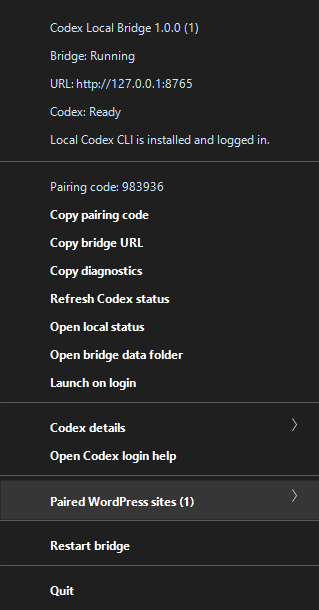

# Documentation

This folder is the project documentation for AI Model Relay, formerly Codex Local Bridge.

- [Architecture](architecture.md) explains the tray app, local HTTP server, provider registry, cached diagnostics, state files, and Gateway handoff.
- [Local Bridge API](local-bridge-api.md) documents the raw localhost HTTP interface, relay routing defaults, chat/media `max_tokens` policy, `token_defaults`, background provider refresh, and live job artifacts.
- [Gateway Integration](gateway-integration.md) documents the production browser-mediated flow used by Alorbach AI Subscription Gateway.
- [Operations](operations.md) is the user and operator guide for provider setup, model routing, token defaults, diagnostics, builds, releases, and common failure cases.
- [Implementation plans](plans/README.md) is the plan-by-plan backlog for token limits, CLI prompt files, chat isolation, and existing-tool hardening. Work one numbered plan at a time.

The small standalone developer example lives in [../examples/http-app](../examples/http-app/README.md).
